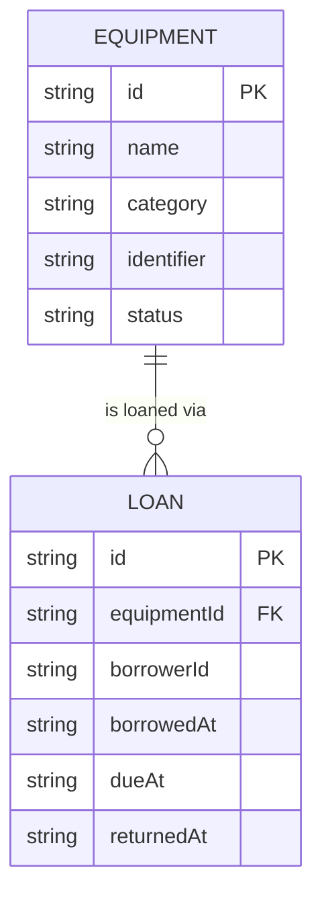

# Domain Model

The system tracks two core entities: the equipment catalog and the loans against it. Each equipment item has at most one open loan at a time.

- `EQUIPMENT.category` is one of the fixed list: Laptop, Projector, Camera, Other.
- `EQUIPMENT.status` is `available`, `on-loan`, or `retired`.
- `LOAN.returnedAt` is null while the loan is open; a loan is overdue when `returnedAt` is null and `dueAt` has passed.
- `LOAN.borrowerId` references the signed-in staff member who borrowed the item.