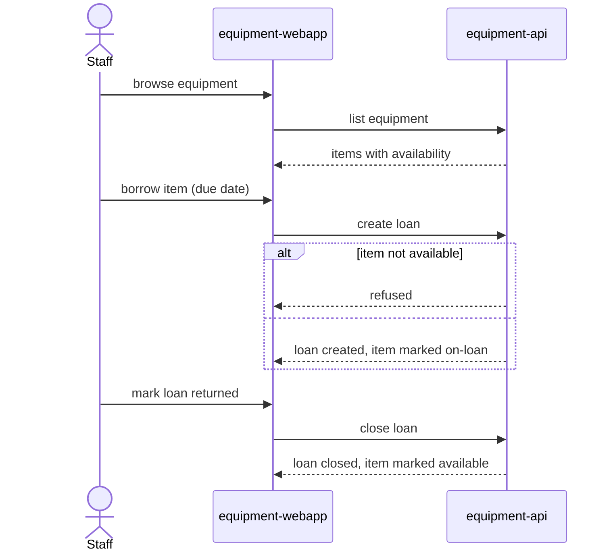

# Borrow an item

A staff member browses the available equipment, borrows an item with a due date, and later marks it returned.

```mermaid
sequenceDiagram
    actor Staff
    participant equipment-webapp
    participant equipment-api

    Staff->>equipment-webapp: browse equipment
    equipment-webapp->>equipment-api: list equipment
    equipment-api-->>equipment-webapp: items with availability

    Staff->>equipment-webapp: borrow item (due date)
    equipment-webapp->>equipment-api: create loan
    alt item not available
        equipment-api-->>equipment-webapp: refused
    else
        equipment-api-->>equipment-webapp: loan created, item marked on-loan
    end

    Staff->>equipment-webapp: mark loan returned
    equipment-webapp->>equipment-api: close loan
    equipment-api-->>equipment-webapp: loan closed, item marked available
```