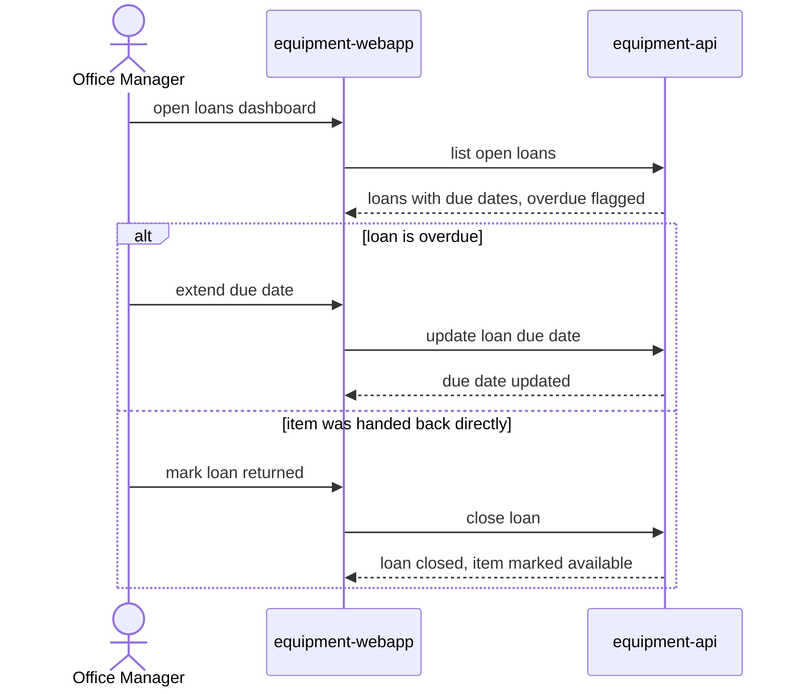

# Track and resolve overdue loans

The office manager reviews what is currently out, identifies overdue loans, and either closes one out or extends its due date.

```mermaid
sequenceDiagram
    actor OfficeManager as Office Manager
    participant equipment-webapp
    participant equipment-api

    OfficeManager->>equipment-webapp: open loans dashboard
    equipment-webapp->>equipment-api: list open loans
    equipment-api-->>equipment-webapp: loans with due dates, overdue flagged

    alt loan is overdue
        OfficeManager->>equipment-webapp: extend due date
        equipment-webapp->>equipment-api: update loan due date
        equipment-api-->>equipment-webapp: due date updated
    else item was handed back directly
        OfficeManager->>equipment-webapp: mark loan returned
        equipment-webapp->>equipment-api: close loan
        equipment-api-->>equipment-webapp: loan closed, item marked available
    end
```